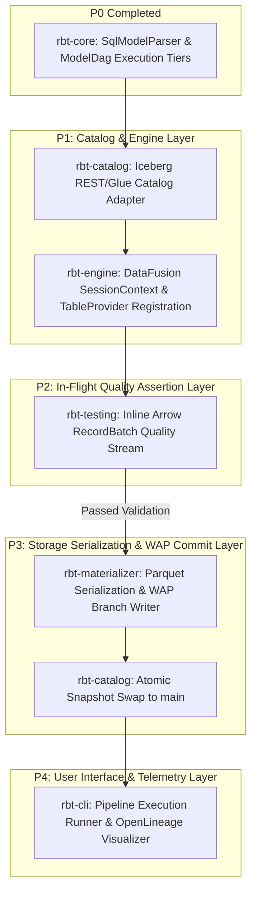

# ADR-001: RBT Subsystem Execution Strategy, Integration Mechanics, and Immediate Engineering Roadmap

- **Status**: Approved / Active  
- **Deciders**: Principal Data Engineering Manager, System Engineering Architecture Team  
- **Date**: July 2026  
- **Technical Scope**: `rbt-catalog`, `rbt-engine`, `rbt-testing`, `rbt-materializer`, `rbt-cli`  

---

## 1. Context & Problem Statement

With the completion of **P0** ([rbt-core](file:///home/farmer/dev-other/rbt/crates/rbt-core/src/lib.rs)), `rbt` possesses a functional AST model dependency parser ([SqlModelParser](file:///home/farmer/dev-other/rbt/crates/rbt-core/src/parser.rs#L14)), Jinja template compiler, circular dependency detector, and topological execution tier compiler ([ModelDag](file:///home/farmer/dev-other/rbt/crates/rbt-core/src/dag.rs#L30)).

To complete the transformation from scaffold to enterprise production engine, `rbt` must now execute queries in memory, evaluate data quality assertions in flight, encode results to Apache Iceberg storage formats, and orchestrate transactional metadata commits without relying on external data warehouses or JVM cluster runtimes.

This Architecture Decision Record (ADR) specifies the precise architectural decisions, integration protocols, API interfaces, and sequential engineering milestones for the next phases of development.

---

## 2. Decision Drivers

1. **Zero-Warehouse Execution**: Eliminate remote SQL DDL execution (Snowflake/BigQuery/Databricks) by evaluating all transformation queries in-memory via Apache DataFusion.
2. **First-Class Iceberg Native Storage**: Treat Apache Iceberg catalogs (REST, AWS Glue, Polaris, Nessie, Hive) as the single source of metadata truth.
3. **Zero-Copy In-Flight Assertions**: Perform data quality verification on streaming Arrow `RecordBatch` chunks *before* data files are committed to object storage.
4. **Write-Audit-Publish (WAP) Data Safety**: Utilize Iceberg snapshot branching (`wap_<run_id>`) to isolate unverified writes from production queries.
5. **Memory Safety & Bounded Resource Usage**: Enforce hard memory reservation limits per container worker using custom DataFusion memory pools.

---

## 3. Detailed Architectural Decisions by Subsystem



---

### Decision 3.1: `rbt-catalog` Architectural Specification

`rbt-catalog` will wrap the official `iceberg` Rust crate (`apache-iceberg`) to provide catalog discovery, table metadata resolution, and atomic snapshot transaction management.

#### Key Architectural Requirements:
1. **Multi-Catalog Provider Interface**:
   ```rust
   use anyhow::Result;
   use iceberg::catalog::Catalog;
   use std::sync::Arc;

   pub struct IcebergCatalogAdapter {
       pub catalog: Arc<dyn Catalog>,
       pub catalog_name: String,
   }

   impl IcebergCatalogAdapter {
       pub async fn new_rest_catalog(uri: &str, warehouse: &str) -> Result<Self> { ... }
       pub async fn new_glue_catalog(region: &str) -> Result<Self> { ... }
       pub async fn new_polaris_catalog(uri: &str, client_id: &str, secret: &str) -> Result<Self> { ... }
   }
   ```
2. **Snapshot Branching for Write-Audit-Publish (WAP)**:
   - `create_wap_branch(table: &TableIdent, run_id: &str) -> Result<String>`: Creates a snapshot branch `wap_<run_id>`.
   - `publish_wap_branch(table: &TableIdent, run_id: &str) -> Result<SnapshotId>`: Fast-forwards the `main` branch pointer to `wap_<run_id>` atomically.

---

### Decision 3.2: `rbt-engine` DataFusion Execution Runtime

`rbt-engine` manages the `datafusion::execution::context::SessionContext`, registers Iceberg catalog tables as DataFusion physical `TableProvider` instances, and optimizes query execution plans.

#### Key Architectural Requirements:
1. **Dynamic Table Registration**:
   Registers all source tables and upstream model outputs into DataFusion:
   ```rust
   pub async fn register_iceberg_table(
       &self,
       table_name: &str,
       iceberg_table: Arc<iceberg::table::Table>,
   ) -> Result<()> {
       let provider = iceberg_datafusion::IcebergTableProvider::new(iceberg_table);
       self.ctx.register_table(table_name, Arc::new(provider))?;
       Ok(())
   }
   ```
2. **Manifest Statistic Predicate Pushdown**:
   Custom `PhysicalOptimizerRule` that inspects Iceberg manifest file min/max statistics during query compilation, skipping non-matching Parquet data files prior to storage fetch.

3. **Tiered Async Pipeline Executor**:
   Iterates through `ModelDag::execution_tiers`, launching parallel tasks within each tier using Tokio `JoinSet` workers bounded by a concurrency `Semaphore`.

---

### Decision 3.3: `rbt-testing` Inline Quality Assertion Engine

`rbt-testing` executes zero-copy data validation directly on streaming Arrow `RecordBatch`es before data manifests are committed.

#### Key Architectural Requirements:
1. **Streaming Assertion Wrapper**:
   Wraps DataFusion `SendableRecordBatchStream` with `InlineQualityStream`:
   ```rust
   pub struct InlineQualityStream {
       pub inner: SendableRecordBatchStream,
       pub rules: Vec<QualityAssertionRule>,
   }
   ```
2. **Zero-Copy Assertion Kernels**:
   - `assert_non_null(array: &dyn Array)`: Inspects Arrow validity bitmap `null_count()` in $O(1)$ time.
   - `assert_unique(array: &dyn Array)`: Evaluates distinct count using `hyperloglogplus` sketches or hash sets.
   - `assert_accepted_values(array: &dyn Array, values: &[ScalarValue])`: SIMD match against predefined scalar lookup arrays.
   - `assert_range(array: &dyn Array, min: ScalarValue, max: ScalarValue)`: SIMD array comparison for value bounds.

---

### Decision 3.4: `rbt-materializer` Parquet Writer & Snapshot Committer

`rbt-materializer` encodes incoming `RecordBatchStream` batches into Iceberg Parquet storage formats and executes catalog snapshot commits.

#### Key Architectural Requirements:
1. **Parquet Storage Encoding**:
   Encodes streams into Parquet data files formatted according to target Iceberg table schema, sort order, and partition specifications.
2. **Manifest List & Snapshot Assembly**:
   Constructs Avro binary `ManifestEntry` files describing newly written data files.
3. **Optimistic Concurrency Control (OCC) Commit Loop**:
   Dispatches atomic transaction commit calls to `rbt-catalog`. If a concurrent commit collision occurs, `rbt-materializer` reloads latest table metadata, re-applies changes, and retries commit up to `max_retries` (default: 5).

---

### Decision 3.5: `rbt-cli` Command Engine & OpenLineage Telemetry

`rbt-cli` provides the developer entrypoint binary, exposing operational subcommands and emitting enterprise lineage metadata.

#### Key Architectural Requirements:
1. **Subcommands**:
   - `rbt compile`: Parses SQL models, extracts AST dependencies, and outputs `target/manifest.json`.
   - `rbt run`: Executes pipeline materialization across target Iceberg catalog.
   - `rbt test`: Runs inline or standalone data quality assertion suites.
   - `rbt docs generate`: Renders static documentation and interactive SVG/Wasm DAG lineage graphs.
2. **OpenLineage Telemetry Output**:
   Emits OpenLineage event JSON specs (Input Datasets, Output Datasets, Model Run State, Execution Duration) for integration with enterprise metadata portals (Marquez, Datakin, Atlan).

---

## 4. Sequential Engineering Roadmap & Milestones

```text
Milestone 1: rbt-catalog & rbt-engine Integration (Target: P1)
  ├── 1.1 Implement Iceberg REST Catalog REST client wrapper in rbt-catalog
  ├── 1.2 Bind IcebergTableProvider into rbt-engine SessionContext
  └── 1.3 Add integration test executing DataFusion SQL over local Iceberg tables

Milestone 2: rbt-testing Inline Assertion Engine (Target: P2)
  ├── 2.1 Implement InlineQualityStream wrapper
  ├── 2.2 Implement SIMD NonNull, Unique, and Range assertion kernels
  └── 2.3 Add fail-fast pipeline abort trigger upon assertion failure

Milestone 3: rbt-materializer WAP Storage Committer (Target: P3)
  ├── 3.1 Implement Iceberg Parquet writer streaming sink
  ├── 3.2 Build Avro manifest entry serializer
  └── 3.3 Implement WAP (Write-Audit-Publish) snapshot commit and swap logic

Milestone 4: rbt-cli Runner & Lineage Telemetry (Target: P4)
  ├── 4.1 Wire CLI commands (`rbt run`, `rbt test`, `rbt compile`)
  ├── 4.2 Add OpenTelemetry tracing and terminal status spinners
  └── 4.3 Add OpenLineage JSON export generator
```

---

## 5. Consequences & Trade-Off Analysis

### Positive Consequences:
- **Order-of-Magnitude Cost Reduction**: Eliminates proprietary warehouse compute fees for query execution and testing.
- **Zero Exposure of Dirty Data**: WAP protocol prevents unverified data from reaching `main` production snapshot branches.
- **Instant Pipeline Startup**: Eliminates 30s-3min PySpark JVM executor warmup latencies.

### Risks & Mitigations:
- *Risk*: DataFusion or Apache Iceberg Rust crate API evolution.
  - *Mitigation*: Lock exact minor dependency versions in workspace `Cargo.toml` and maintain isolated wrapper abstraction layers in `rbt-catalog` and `rbt-engine`.
- *Risk*: Memory spikes during large hash joins or aggregations.
  - *Mitigation*: Implement custom DataFusion `MemoryPool` allocators to spill intermediate batches to disk under RAM pressure.

---

## Summary of Decisions

1. **Catalog**: Use `rbt-catalog` as an abstraction layer over `apache-iceberg` REST/Glue protocols.
2. **Engine**: Execute transformations in-memory via `rbt-engine` DataFusion physical plans.
3. **Quality**: Validate data in-flight using zero-copy `rbt-testing` bitmask kernels.
4. **Storage**: Commit Parquet files via `rbt-materializer` using Iceberg WAP snapshot branching.
5. **CLI & Telemetry**: Provide a single binary `rbt-cli` emitting OpenLineage telemetry.
