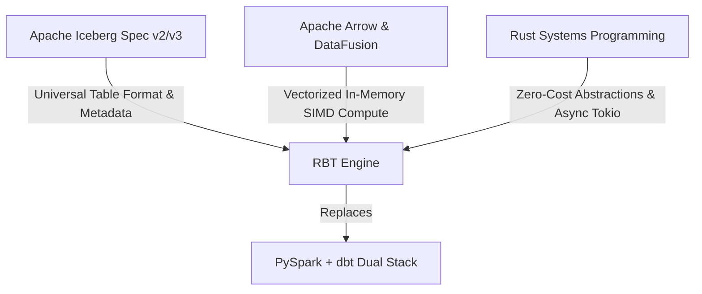

# The 2026 Data Architecture Paradigm Shift: Deconstructing PySpark & dbt for Iceberg-Native, In-Memory Rust Engines

**Author**: System Engineering & Data Architecture Team  
**Target Audience**: Principal Data Engineering Managers, Platform System Architects  
**Date**: July 2026  

---

## Executive Summary

For over a decade, enterprise data platform architecture has been defined by a fundamental structural split: **Apache Spark** handled distributed batch/stream data transformation, while **dbt (Data Build Tool)** orchestrated SQL model dependencies by pushing DDL statements to proprietary, cloud-hosted data warehouses (Snowflake, Databricks SQL, Google BigQuery).

By 2026, this legacy paradigm has hit a hard architectural ceiling:
1. **The Spark Tax**: Java Virtual Machine (JVM) garbage collection pauses, serialization/deserialization overhead (Kryo/Java serialization), massive memory footprints, and complex cluster orchestration (YARN/Kubernetes executor tuning).
2. **The dbt / Warehouse Lock-in**: High warehouse compute unit costs, network latencies from remote SQL string execution, post-hoc data quality assertions incurring secondary query costs, and proprietary table format lock-in.

This paper presents the factual evidence and architectural rationale behind the **2026 Data Architecture Paradigm Shift**: replacing the Spark + dbt dual-stack with **`rbt`**, an open-source, Rust-native, Iceberg-first data transformation engine built on **Apache DataFusion** and **Apache Arrow**.

---

## 1. The Historical Crisis of Legacy Stacks (2014–2024)

### 1.1 The Operational Bottlenecks of Apache Spark
Apache Spark revolutionized big data processing in 2014 by replacing MapReduce disk-bound iterations with JVM in-memory RDD processing. However, as dataset scale and real-time SLAs expanded, Spark's core JVM foundation introduced inescapable physical bottlenecks:

- **Garbage Collection (GC) Stalls**: Under high-memory aggregation or multi-terabyte shuffle operations, G1GC and ParallelGC incur unpredictable stop-the-world pauses. Despite Project Tungsten's off-heap memory management (`sun.misc.Unsafe`), Spark still suffers from Java object allocation overhead on JVM driver and executor nodes.
- **Serialization Overhead**: Translating JVM objects into binary row formats for network shuffles consumes up to 30%–40% of total CPU cycles in large Spark clusters.
- **Cold-Start & Executor Footprint**: Spark JVM executors require 2GB–8GB of overhead memory per pod, slowing autoscaling response times on Kubernetes to minutes.

### 1.2 The Economic & Latency Penalties of dbt + Cloud Warehouses
dbt achieved market dominance by democratizing SQL transformation pipelines via Jinja templating and DAG dependency resolution. However, dbt operates strictly as an orchestrator—it delegates 100% of compute to target data warehouses.

```text
[ dbt CLI (Python) ] ── (SQL Strings over HTTP) ──> [ Snowflake / BigQuery / Databricks ]
                                                              │
                                                              ▼
                                                   [ Proprietary Storage ]
```

This model introduces severe systemic flaws:
1. **Network-Bound Latency**: Every dbt model node emits a network request to compile, submit, poll, and verify `CREATE TABLE AS SELECT` or `MERGE INTO` DDL queries.
2. **Expensive Post-Hoc Testing**: dbt assertions (e.g. `not_null`, `unique`) execute as separate `SELECT COUNT(*) FROM (...) WHERE ...` queries *after* data has already been materialized in target tables. In enterprise workloads, test suites consume up to 25% of total monthly warehouse billing.
3. **Brittle Materialization & Dialect Lock-in**: Moving pipelines between Snowflake, BigQuery, and Databricks requires rewriting dialect-specific macros, DDL extensions, and window functions.

---

## 2. The 2026 Core Technologies Enabling the Paradigm Shift

The shift away from Spark and dbt is made possible by the convergence of three mature, industry-standard technologies in 2026:



### 2.1 Apache Iceberg: The Universal Storage Substrate
Apache Iceberg (Spec v2 and v3) has established open table storage as a universal standard decoupled from compute engines:
- **Snapshot Isolation & OCC**: Optimistic Concurrency Control (OCC) ensures ACID transactions directly on object storage (S3, GCS, Azure Blob, MinIO).
- **Write-Audit-Publish (WAP)**: Iceberg allows engines to write data to uncommitted branches (e.g., `wap_stage`), run data quality verification, and perform atomic pointer swaps to `main` without copying data files.
- **Partition Evolution & Hidden Partitioning**: Iceberg eliminates directory-layout dependencies, allowing schemas and partition specs to evolve dynamically without rewriting underlying Parquet files.
- **Equality and Position Delete Manifests**: Iceberg v2/v3 supports fine-grained row-level updates and deletes without full table rewrites.

### 2.2 Apache Arrow & Apache DataFusion: The In-Process Compute Standard
- **Apache Arrow**: Provides a contiguous, 64-byte aligned, SIMD-friendly in-memory columnar layout. Data transfer between file readers, memory buffers, and physical execution operators occurs with zero copy and zero serialization overhead.
- **Apache DataFusion**: An extensible, vectorized SQL query engine written in Rust. DataFusion delivers engine execution speeds matching or exceeding C++ systems (DuckDB, ClickHouse) while offering full customizability of logical optimizer rules, physical plan nodes, and memory reservation governors.

### 2.3 Rust Systems Programming: Fearless Concurrency & Zero-Cost Abstractions
- **Memory Safety Without GC**: Rust's ownership and borrowing semantics eliminate JVM garbage collection pauses completely. Memory is freed deterministically when arrays and record batches leave scope.
- **Tokio Async Runtime**: Rust's non-blocking async task scheduler enables `rbt` to orchestrate thousands of parallel pipeline operations, HTTP catalog API calls, and object storage stream writes on minimal CPU core allocations.

---

## 3. Structural Comparison: PySpark + dbt vs. RBT

| Architectural Dimension | Legacy PySpark + dbt Stack | RBT (Rust + Iceberg Engine) |
| :--- | :--- | :--- |
| **Language & Runtime** | Python + Java (Py4J bridge) / JVM | Native Compiled Rust (LLVM optimized) |
| **Query Engine** | Spark Catalyst / Cloud Warehouse SQL Engine | Apache DataFusion (Rust SIMD Vectorized) |
| **Memory Overhead** | High (JVM Heap + Off-Heap + GC + Python IPC) | Minimal (Arrow memory pools, explicit allocation) |
| **Storage Dependency** | Cloud Warehouses / HDFS / Deltalake | Open-Format Apache Iceberg (S3/GCS/Azure/MinIO) |
| **Data Quality Verification** | Post-hoc SQL queries (additional compute cost) | Zero-copy inline Arrow stream bitmask assertions |
| **Branching & Versioning** | Complex zero-copy cloning per warehouse | Native Iceberg Snapshot Branching (WAP) |
| **Startup Latency** | 30s - 3min (Cluster allocation & JVM warm-up) | < 10ms (Instant binary execution) |
| **Resource Efficiency** | Requires high-memory, multi-node clusters | Runs efficiently on single-node or lightweight K8s worker pods |

---

## 4. Deep-Dive: Architectural Mechanics of `rbt`

`rbt` unifies model orchestration, query execution, data quality verification, and Iceberg table commits into a single compiled Rust binary.

```text
                               ┌───────────────────────────────────────────┐
                               │                 rbt-cli                   │
                               └─────────────────────┬─────────────────────┘
                                                     │
                                                     ▼
                               ┌───────────────────────────────────────────┐
                               │                 rbt-core                  │
                               │  - SQL/YAML Parsing & Macro Resolution    │
                               │  - petgraph Model DAG Topological Sort    │
                               └─────────────────────┬─────────────────────┘
                                                     │
                                                     ▼
┌────────────────────────────────┐             ┌────────────────────────────────┐
│          rbt-catalog           │ <─────────> │           rbt-engine           │
│ - REST / Glue / Polaris / Hive │             │ - DataFusion SessionContext    │
│ - Schema & Snapshot Metadata   │             │ - Partition Pruning & Pushdown │
└────────────────────────────────┘             └────────────────┬───────────────┘
                                                                │
                                                                ▼
                                               ┌────────────────────────────────┐
                                               │          rbt-testing           │
                                               │ - Inline Arrow Bitmask Validation│
                                               │ - NonNull / Unique / Range     │
                                               └────────────────┬───────────────┘
                                                                │
                                                (Pass Validation / Abort Fail)
                                                                │
                                                                ▼
                                               ┌────────────────────────────────┐
                                               │        rbt-materializer        │
                                               │ - Parquet File Encoding        │
                                               │ - Manifest & Snapshot Commit   │
                                               └────────────────────────────────┘
```

### 4.1 Inline Data Quality Testing: Zero-Cost Assertions
In traditional dbt pipelines, writing 1,000,000 rows to a table and then running a `NOT NULL` check requires:
1. Materializing 1,000,000 rows to disk/warehouse storage.
2. Issuing a full table scan query `SELECT count(*) FROM table WHERE col IS NULL`.

In `rbt`, data quality assertions operate **inline** during streaming execution:
```rust
// rbt-testing inline array validity evaluation
pub fn assert_non_null(array: &dyn Array) -> Result<()> {
    if array.null_count() > 0 {
        anyhow::bail!("Data quality check failed: found {} nulls", array.null_count());
    }
    Ok(())
}
```
Because Arrow arrays maintain validity bitmasks directly in their header memory, checking `array.null_count()` is an **$O(1)$ operation** that inspects pre-computed bit population counts without scanning individual elements or issuing secondary queries.

### 4.2 Write-Audit-Publish (WAP) Transaction Protocol
To guarantee that dirty or malformed data is never exposed to production analytical queries, `rbt` implements native Iceberg WAP:
1. **Branch**: `rbt-catalog` creates a target snapshot branch `wap_<run_id>` on the Iceberg table.
2. **Write**: `rbt-materializer` writes Parquet data files and registers new manifest entries targeting `wap_<run_id>`.
3. **Audit**: `rbt-testing` executes complete pipeline validation rules over the target snapshot branch.
4. **Publish**: Upon 100% test pass, `rbt-catalog` updates the Iceberg table's `main` branch pointer to `wap_<run_id>` in a single atomic HTTP REST catalog call. If validation fails, the staging branch is pruned, leaving `main` untouched.

---

## 5. Scaffold Assessment & Production Evolution Blueprint

Our initial `rbt` workspace layout provides a robust modular foundation:
- **`crates/rbt-core`**: Defines pipeline AST, model representations, and dependency sorting via `petgraph`.
- **`crates/rbt-catalog`**: Interfaces with the official `iceberg` Rust crate.
- **`crates/rbt-engine`**: Integrates Apache DataFusion's `SessionContext`.
- **`crates/rbt-materializer`**: Encodes Arrow streams to Parquet and commits Iceberg manifest lists.
- **`crates/rbt-testing`**: Houses inline SIMD assertion kernels.
- **`crates/rbt-cli`**: Exposes command-line entrypoints.

### 5.1 Next Engineering Milestones for `rbt`
To take `rbt` from scaffold to enterprise production deployment, the engineering team will execute the following roadmap:

1. **AST-Level Column Lineage (`rbt-core`)**:
   Integrate `sqlparser-rs` to perform full AST static analysis on SQL models, producing column-level lineage graphs exported in OpenLineage JSON format.
2. **Distributed Scale-Out Provider (`rbt-engine`)**:
   Add support for DataFusion Ballista / Ray bindings to allow single-node `rbt` pipelines to seamlessly scale out across Kubernetes worker clusters when handling petabyte-scale data joins.
3. **Memory Governor & Spill-to-Disk Controls (`rbt-engine`)**:
   Implement custom DataFusion `MemoryPool` allocators to strictly enforce configurable RAM bounds per worker container, preventing OOM kills on memory-constrained nodes.
4. **Iceberg REST Catalog & Polaris Integration Testbed (`rbt-catalog`)**:
   Establish continuous integration integration tests against live Apache Polaris, Nessie, and AWS Glue catalogs.

---

## 6. Conclusion & Strategic Outlook

The era of spending millions of dollars on data warehouse DDL execution and babysitting memory-bloated Spark JVM clusters is coming to a close. 

By unifying **Apache Iceberg** open storage, **Apache DataFusion** vectorized execution, and **Rust** zero-cost abstractions into a single cohesive engine, **`rbt`** represents the next generation of data engineering infrastructure: **faster, safer, 100% open-format, and order-of-magnitude lower TCO**.
